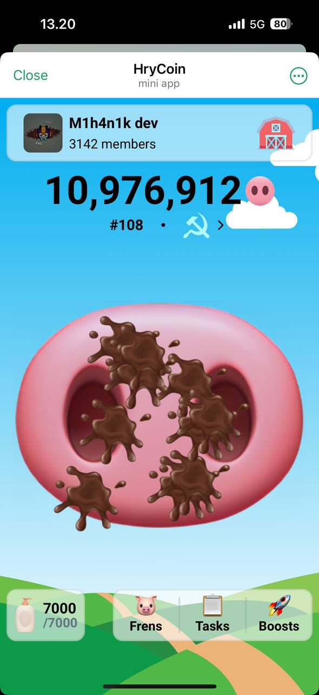
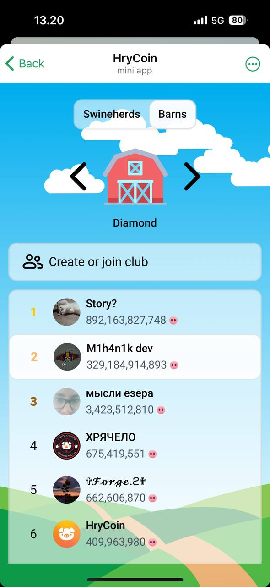
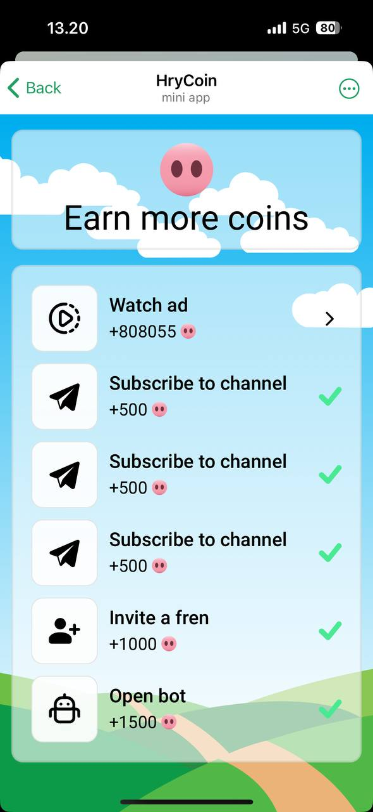
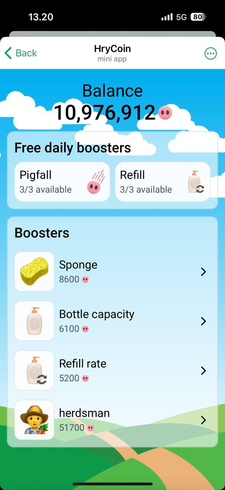

# Tap-tap game PigCoin

## Overview
A tap-tap game where you can earn coins by washing the pig. Following the trend in Telegram on tap2earn games 
started by Durov's team and game NotCoin

   

## Before starting
### Economics
You probably want to change the economics of the game, then change the prices of boosts and 
tasks in `backend/database/initialization.py` and adjust the prices of boosts in `frontend/src/components/Booster.vue` 
on lines 36 and 55.

If you want to change the calculation of the reward for watching the ad, then change the calculation
in `frontend/src/views/Tasks.vue` on line 29 and in `backend/database/crud/tasks.py` on line 36.

Changing frontend part is not necessary, but for better user experience I calculate it in the frontend part as well.

If you want to change the logic of auto-coins then it's in `backend/database/models.py` in the `User`
model in `auto_coins`

If you want to verify "bot open" task's completion, then set up the api link in `./routers/tasks.py` in
function `complete_task`

### Configs
To use your own Google tag - change it in the `frontend/src/main.ts` on line 32.\
To use your own AdsGram - change blockId in the `frontend/src/views/Tasks.vue` on line 25.

### CI/CD
To use CI/CD change the ip of you server in `./.github/workflows/main.yml` and define secrets used in the pipeline

### Development
If you are going to run the app in the dev environment without ssl certificates, you need to use the testing 
servers of telegram, read more here https://core.telegram.org/bots/webapps#testing-mini-apps

## How to start
### Using docker
1. Create and fill in the `backend/.env` file
2. Create and fill in the `frontend/.env` file
3. Run 
    ```bash
    docker compose up --build -d
    ```

Now you have bot, notifier, backend, frontend and mysql running in docker containers. You can access them from the 
app you specified in frontend .env file

### Without docker
Check README in backend and frontend to host the app without docker